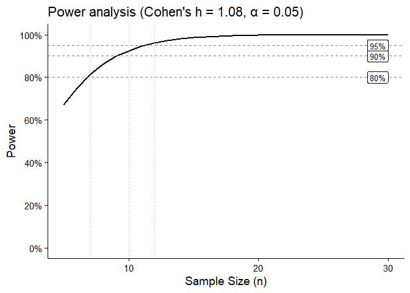
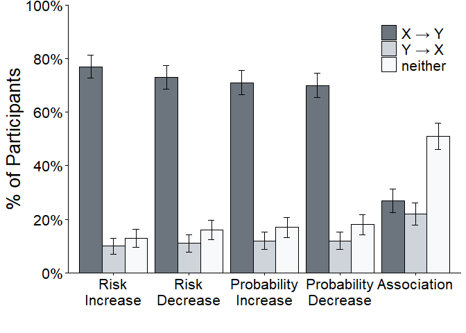
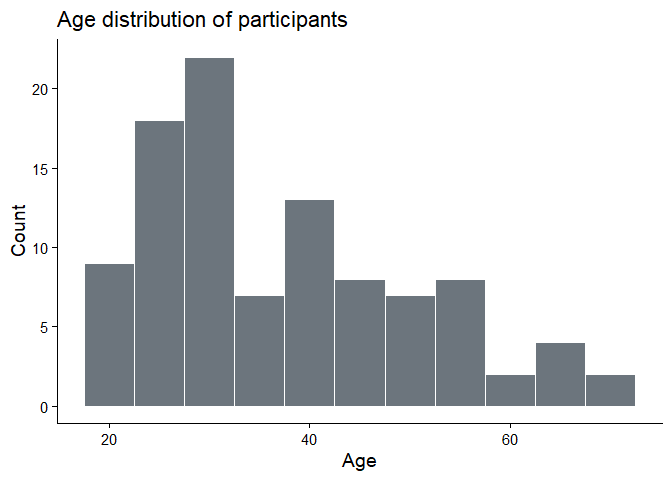

---
author:
- Amir Zur
authors:
- Amir Zur
date: 2026-06-05
title: "Replication of Gershman & Ullman (2023): Causal Implicatures
  from Correlational Statements"
toc-title: Table of contents
toc_depth: 3
---

-   [Introduction](#introduction){#toc-introduction}
-   [Methods](#methods){#toc-methods}
    -   [Power Analysis](#power-analysis){#toc-power-analysis}
    -   [Planned Sample](#planned-sample){#toc-planned-sample}
    -   [Materials](#materials){#toc-materials}
    -   [Procedure](#procedure){#toc-procedure}
    -   [Analysis Plan](#analysis-plan){#toc-analysis-plan}
    -   [Differences from Original
        Study](#differences-from-original-study){#toc-differences-from-original-study}
    -   [Methods Addendum (Post Data
        Collection)](#methods-addendum-post-data-collection){#toc-methods-addendum-post-data-collection}
-   [Results](#results){#toc-results}
    -   [Data preparation](#data-preparation){#toc-data-preparation}
    -   [Confirmatory
        analysis](#confirmatory-analysis){#toc-confirmatory-analysis}
    -   [Exploratory
        analyses](#exploratory-analyses){#toc-exploratory-analyses}
-   [Discussion](#discussion){#toc-discussion}
    -   [Summary of Replication
        Attempt](#summary-of-replication-attempt){#toc-summary-of-replication-attempt}
    -   [Commentary](#commentary){#toc-commentary}

<!-- Replication reports should all use this template to standardize reporting across projects.  These reports will be public supplementary materials that accompany the summary report(s) of the aggregate results. -->

## Introduction

Although it is commonly observed that correlation does not imply
causation, people do use correlational statements to inform their causal
models of the world. That is, in a conversation about topic $A$, the
statement \`\`$A$ `\textit{is associated with}`{=tex} $B$'' can lead a
listener to interpret that a causal relationship holds between $A$ and
$B$. As Lassiter and Franke (2024) observe, this inference is plausibly
guided by pragmatic assumptions: a speaker who endeavors to say relevant
things would not mention a correlation they believe is spurious (except
in a conversation about surprising, accidental correlations). Because
non-causal correlations are not informative, a listener can infer that
statements about correlations are intended by the speaker as relevant to
a causal world model.

Gershman and Ullman (2023) report that English speakers reading about
associations between nonce words ($A$
`\textit{is associated with}`{=tex} $B$) preferred to interpret the
subject as an effect rather than cause. Why participants have this
preference is unclear, given that the predicate describes a symmetric
relationship. That is, causes and effects are equally plausible in
subject position when readers have clear expectations about the likely
direction of causation
(`\textit{smoking is associated with cancer}`{=tex} and
`\textit{cancer is associated with smoking}`{=tex}).

This report is a replication of Gershman and Ullman (2023). In the
study, participants chose the cause from a correlational statement with
nonce words. For example, seeing "Themaglin is associated with Pneuben",
participants were asked to choose whether "Themaglin causes Pneuben" or
"Pneuben causes Themaglin". We replicated Study 3, where participants
had a third option: "A third factor is causally related to \[X\] and
\[Y\], they are not directly related". Surprisingly, Gershman and Ullman
(2023) find that the $B \to A$ interpretation flips when the third
option is presented; whereas most participants opted for "Neither",
participants significantly preferred $A \to B$ to $B \to A$. We find
that this result doesn't replicate, suggesting that participants are
equally likely to choose between $A \to B$ and $B \to A$ when presented
with a third "Neither" option.

## Methods

### Power Analysis

Because Study 3 does not report effect sizes directly, we estimated
required sample sizes using the effect size from Study 2's risk increase
condition (nonsense-names version), where the proportion of participants
choosing $A \to B$ was $M = 0.94$ ($SE = 0.02$, $Z = 17.91$,
$p < 10^{-71}$). This represents a strong effect and serves as a
reference for Study 3. We converted to Cohen's $h$ for a one-sample
proportion $z$-test against chance ($p_\emptyset = 0.5$).

The estimated Cohen's h is 1.08. To achieve 80%, 90%, and 95% power
requires sample sizes of n = 7, 10, and 12, respectively. This means
that the planned sample of 100 participants is more than sufficient for
our purposes.

::::: cell
::: {.cell-output .cell-output-stderr}
    Warning in annotate("label", x = 30, y = c(0.8, 0.9, 0.95), label = c("80%", :
    Ignoring unknown parameters: `label.size`
:::

::: cell-output-display

:::
:::::

### Planned Sample

We followed the original paper in recruiting participants.

> "We recruited 100 participants, matching the sample sizes of the
> different conditions. Written/verbal informed consent was obtained
> from all participants for inclusion in the study. Participants were
> US-based. No participants were excluded. The mean age of participants
> was 34.8, 63 identified as female, and 37 identified as male."

However, in our setting, we recruited English-speaking participants from
outside of the United States in addition to US-based participant.

### Materials

We used the original materials, which include a list of nonce words and
templates for "X is associated with \[an increased/decreased
risk/probability of\] Y". The materials are available at
https://osf.io/u34ex/overview?view_only=1ffdf6729af149d6b14f7e32692c0334.

### Procedure

We followed the original procedure from the paper.

> "Participants were informed that they would be asked a few simple
> questions about the possible relationship between different things,
> and that the questions were unrelated to one another. The ordering of
> the nonsense term pairs within each question, the ordering of the
> forced choice answers to each question, and the question order of the
> five questions was randomized."

Our participants saw a consent form before opting to begin the study. We
also included a warm-up activity where participants were asked to infer
the order of events in a sentence. For example, reading "While Maria was
typing her report, the phone rang", participants were asked to judge
whether the typing of the report or the ringing of the phone took place
first.

### Analysis Plan

Within each of the five conditions (risk increase, risk decrease,
probability increase, probability decrease, and simple association), we
conducted three pairwise two-sided proportion $z$-tests comparing: (1)
$A \to B$ versus $B \to A$; (2) $A \to B$ versus Neither; and (3)
$B \to A$ versus Neither. This yielded 15 total comparisons, corrected
for multiple comparisons using the Holm-Bonferroni procedure.

We focus on testing whether the surprising finding that the rate
$A \to B$ responses differs from the proportion of $B \to A$ responses
replicates. The original paper found that $A \to B$ was chosen
significantly more often than $B \to A$ in the association condition
(whereas $B \to A$ was chosen significantly more often when Neither
wasn't included).

### Differences from Original Study

The original study recruited exclusively US-based participants. This
replication was conducted via Prolific with eligibility extended to
participants in the US, UK, and Canada, which may introduce
cross-national variation in how causal language is interpreted.
Additionally, the original study was administered as a standalone
survey; the current replication used the same stimuli and logic but was
implemented via jsPsych and hosted on a web server.

### Methods Addendum (Post Data Collection)

#### Actual Sample

We recruited 100 participants via Prolific (mean age = 37.2, SD = 13,
range 19--70; 50 identified as female, 48 as male, 2 preferred not to
say). No participants were excluded.

## Results

### Data preparation

Data preparation following the analysis plan.

::: cell
``` {.r .cell-code}
condition_labels <- c(
  prob_lower    = "Probability\nDecrease",
  risk_lower    = "Risk\nDecrease",
  prob_increase = "Probability\nIncrease",
  risk_increase = "Risk\nIncrease",
  assoc         = "Association"
)

response_labels <- c(
  xy      = "X → Y",
  yx      = "Y → X",
  neither = "neither"
)

df.causal_inference <- read_csv("responses/processed/final.csv") |>
  filter(task == "causal_judgment") |>
  mutate(
    condition = factor(recode(condition, !!!condition_labels),
                       levels = c("Risk\nIncrease", "Risk\nDecrease", "Probability\nIncrease",
                                  "Probability\nDecrease", "Association")),
    response  = factor(recode(response_type, !!!response_labels),
                       levels = c("X → Y", "Y → X", "neither"))
  )

df.summary <- df.causal_inference |>
  count(condition, response) |>
  group_by(condition) |>
  mutate(
    pct = n / sum(n),
    se = sqrt(pct * (1 - pct) / sum(n))
  )
```
:::

### Confirmatory analysis

:::::: cell
``` {.r .cell-code}
ggplot(df.summary, aes(x = condition, y = pct, fill = response)) +
  geom_col(position = position_dodge(width = 0.9), color = "black") +
  geom_errorbar(aes(ymin = pct - se, ymax = pct + se),
                position = position_dodge(width = 0.9), width = 0.25) +
  scale_y_continuous(breaks = seq(from = 0, to = 1, by = 0.2),
                     labels = scales::percent, expand = F) +
  coord_cartesian(ylim = c(0, 1)) +
  labs(x = "", y = "% of Participants", fill = "") +
  theme_classic() +
  theme(legend.position = c(0.88, 0.88), text = element_text(size = 20)) +
  scale_fill_manual(values=c("#6c757d", "#ced4da", "#f8f9fa"))
```

::: cell-output-display

:::

``` {.r .cell-code}
ggsave(filename = "replication.pdf",
       width = 8,
       height = 6)
```

::: {.cell-output .cell-output-stderr}
    Warning in grid.Call.graphics(C_text, as.graphicsAnnot(x$label), x$x, x$y, :
    for 'X → Y' in 'mbcsToSbcs': -> substituted for → (U+2192)
:::

::: {.cell-output .cell-output-stderr}
    Warning in grid.Call.graphics(C_text, as.graphicsAnnot(x$label), x$x, x$y, :
    for 'Y → X' in 'mbcsToSbcs': -> substituted for → (U+2192)
:::
::::::

We conducted 15 pairwise two-sided proportion $z$-tests (3 per
condition) and applied the Holm-Bonferroni correction across all
comparisons.

:::: cell
``` {.r .cell-code}
get_tests <- function(xy, yx, nei) {
  n <- xy + yx + nei
  pz_stat <- function(a, b) {
    pp <- (a + b) / (2 * n)
    se <- sqrt(pp * (1 - pp) * 2 / n)
    (a / n - b / n) / se
  }
  z_vals <- c(pz_stat(xy, yx), pz_stat(xy, nei), pz_stat(yx, nei))
  tibble(
    comparison = c("X→Y vs Y→X", "X→Y vs Neither", "Y→X vs Neither"),
    Z     = round(z_vals, 2),
    p_raw = 2 * pnorm(-abs(z_vals))
  )
}

df.counts <- df.causal_inference |>
  count(condition, response) |>
  pivot_wider(names_from = response, values_from = n, values_fill = 0) |>
  rename(xy = `X → Y`, yx = `Y → X`, nei = neither)

df.tests <- df.counts |>
  mutate(tests = pmap(list(xy, yx, nei), get_tests)) |>
  unnest(tests) |>
  mutate(p_adj = p.adjust(p_raw, method = "holm")) |>
  arrange(condition, comparison) |>
  mutate(
    sig = case_when(
      p_adj < .001 ~ "***",
      p_adj < .01  ~ "**",
      p_adj < .05  ~ "*",
      TRUE         ~ "ns"
    ),
    condition = str_replace_all(as.character(condition), "\n", " ")
  )

df.tests |>
  select(Condition = condition, Comparison = comparison, Z,
         `p (raw)` = p_raw, `p (Holm-Bonf.)` = p_adj, ` ` = sig) |>
  mutate(
    `p (raw)`        = format.pval(`p (raw)`, digits = 3, eps = 0.001),
    `p (Holm-Bonf.)` = format.pval(`p (Holm-Bonf.)`, digits = 3, eps = 0.001)
  ) |>
  knitr::kable(caption = "Pairwise proportion z-tests with Holm-Bonferroni correction")
```

::: cell-output-display
  --------------------------------------------------------------------------------
  Condition             Comparison            Z p (raw)   p (Holm-Bonf.)  
  --------------------- --------------- ------- --------- --------------- --------
  Risk Increase         X→Y vs Neither     9.10 \<0.001   \< 0.001        \*\*\*

  Risk Increase         X→Y vs Y→X         9.56 \<0.001   \< 0.001        \*\*\*

  Risk Increase         Y→X vs Neither    -0.66 0.506     1.00000         ns

  Risk Decrease         X→Y vs Neither     8.11 \<0.001   \< 0.001        \*\*\*

  Risk Decrease         X→Y vs Y→X         8.88 \<0.001   \< 0.001        \*\*\*

  Risk Decrease         Y→X vs Neither    -1.03 0.301     1.00000         ns

  Probability Increase  X→Y vs Neither     7.69 \<0.001   \< 0.001        \*\*\*

  Probability Increase  X→Y vs Y→X         8.47 \<0.001   \< 0.001        \*\*\*

  Probability Increase  Y→X vs Neither    -1.00 0.315     1.00000         ns

  Probability Decrease  X→Y vs Neither     7.41 \<0.001   \< 0.001        \*\*\*

  Probability Decrease  X→Y vs Y→X         8.34 \<0.001   \< 0.001        \*\*\*

  Probability Decrease  Y→X vs Neither    -1.19 0.235     1.00000         ns

  Association           X→Y vs Neither    -3.48 \<0.001   0.00302         \*\*

  Association           X→Y vs Y→X         0.82 0.411     1.00000         ns

  Association           Y→X vs Neither    -4.26 \<0.001   \< 0.001        \*\*\*
  --------------------------------------------------------------------------------

  : Pairwise proportion z-tests with Holm-Bonferroni correction
:::
::::

In the conditions with additional context (all but Association),
$A \to B$ is significantly higher than $B \to A$ and Neither, as the
original study showed.However, the $A \to B$ versus $A \to B$ comparison
in the Association condition yielded $Z =$ 0.82, $p($Holm-Bonf.$) =$ 1.
This didn't replicate: there was no significant difference between
$A \to B$ and $A \to B$ in the association condition.

### Exploratory analyses

We report the age distribution, country of residency, and sex
identification of the participants below.

:::::: cell
``` {.r .cell-code}
df.demo |>
  count(Sex) |>
  mutate(`%` = scales::percent(n / sum(n), accuracy = 1)) |>
  knitr::kable(caption = "Sex distribution of participants")
```

::: cell-output-display
  Sex                    n \%
  ------------------- ---- -----
  Female                50 50%
  Male                  48 48%
  Prefer not to say      2 2%

  : Sex distribution of participants
:::

``` {.r .cell-code}
df.demo |>
  count(`Country of residence`) |>
  arrange(desc(n)) |>
  mutate(`%` = scales::percent(n / sum(n), accuracy = 1)) |>
  knitr::kable(caption = "Country of residence")
```

::: cell-output-display
  Country of residence      n \%
  ---------------------- ---- -----
  United States            64 64%
  Canada                   17 17%
  United Kingdom            9 9%
  Australia                 5 5%
  New Zealand               3 3%
  Ireland                   2 2%

  : Country of residence
:::

``` {.r .cell-code}
ggplot(df.demo, aes(x = Age)) +
  geom_histogram(binwidth = 5, fill = "#6c757d", color = "white") +
  labs(x = "Age", y = "Count", title = "Age distribution of participants") +
  theme_classic(base_size = 14)
```

::: cell-output-display

:::
::::::

## Discussion

### Summary of Replication Attempt

The replication successfully reproduced the main findings of Gershman
and Ullman (2023) Study 3 for all four directional-language conditions.
Across risk increase, risk decrease, probability increase, and
probability decrease conditions, the proportion of $A \to B$ responses
was substantially and significantly higher than both $B \to A$ and
Neither (all Holm-Bonferroni corrected $p < .001$), replicating the
original finding that directional language reliably triggers a forward
causal implicature. The association condition also replicated the
finding that Neither was the most common response, with both Neither \>
$A \to B$ and Neither \> $A \to B$ surviving correction, consistent with
the interpretation that neutral association language does not strongly
implicate direct causation.

However, one finding that did not replicate was the directional
asymmetry within the association condition. The original study found
significantly more $A \to B$ than $A \to B$ responses for the simple
association statement, but in our replication these proportions were
nearly equal (27% vs. 22%) and did not differ significantly after
correction (\$Z = \$0.82, \$p = \$ 1).

### Commentary

The finding that the asymmetry between $A \to B$ and $B \to A$ did not
replicate suggests that adding a Neither condition doesn't significantly
change the way in which participants infer causation from correlation,
and is a huge relief to me. I'm still curious about the $B \to A$
reading in the ambiguous case without the Neither condition.
